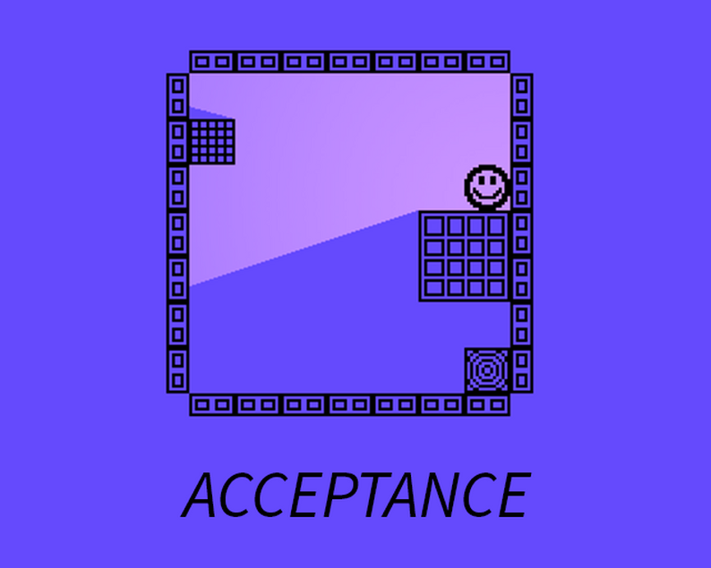
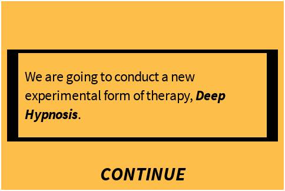
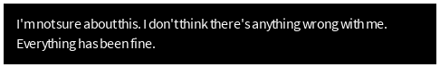
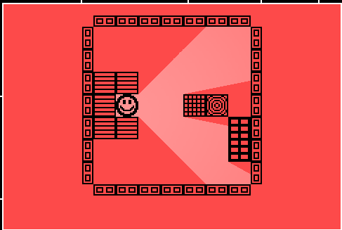

# ld48_acceptance
Entry for the Ludum Dare 48 Game Jam. A game about going through the cycles of acceptance.

# Acceptance Is A Cycle

### Undergo hypnosis in order to find what you're looking for

Acceptance is a sliding puzzle game. Slide your way through the maze and get to the goal to go deeper into hypnosis.

------

### *_Go deeper_* to discover the truth

### Don't lose *_focus_*

### _You're almost there_
------
## Postmortem
I learned a lot from this game jam. I'd never used Godot before, and I've learned that I love that engine more than anything I've used previously. It just made sense to me. Unfortunately, due to the time crunch, there  were things that slipped through the cracks. Here's some stuff I'd like to improve:

- Level difficulty
- Sound effects (the music is slappin' though)
- More levels
- More interaction and obstacles on the levels

The levels are pretty basic as they are. All of the mechanics are there though to create more advanced levels. I will likely release a v2.0 using the same framework I built.

# TODO
- [X] Create initial assets
  - [X] Tilemap for levels
  - [X] Frame texture for main GUI
  - [X] Button texture
  - [X] Player texture
- [X] Player
	- [X] Player movement
	- [X] Arrow Indicator
- [X] Map generation
  - [X] Collisions
  - [X] Goal marker
  - [X] Colors per map
- [X] Scene switching
- [X] Add narrative text
- [X] Add lighting
- [ ] Add sound effects
- [X] Add music
